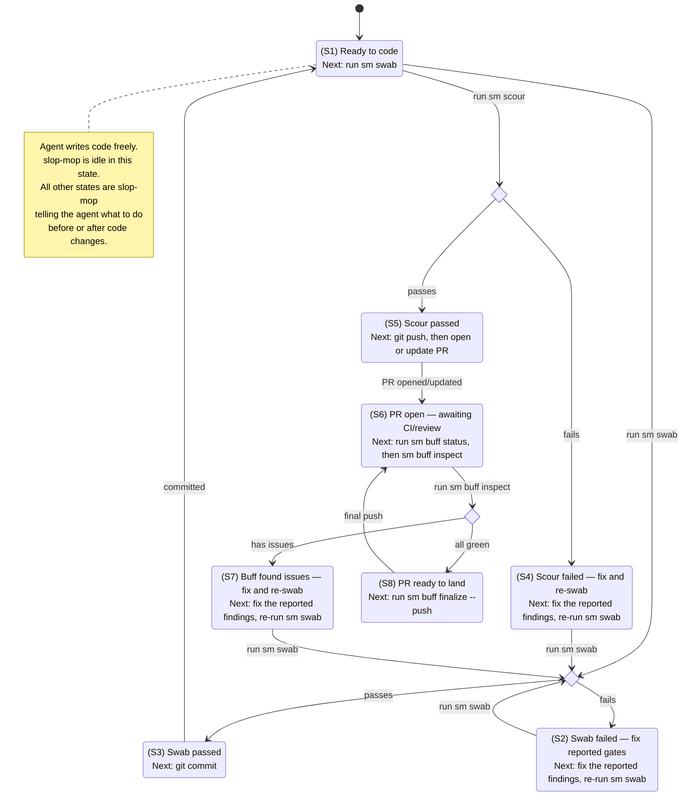

# Slop-Mop Workflow

> **Auto-generated** — do not edit by hand.
> Source of truth: `slopmop/workflow/state_machine.py`
> Re-generate: `python scripts/gen_workflow_diagrams.py`

The slop-mop development loop is a small state machine.  Every tool
invocation advances the machine; the swab/scour/buff outputs always
tell you the next step.

---

## State diagram

---

## States

| ID | State | Label | Next action |
|---|---|---|---|
| S1 | `idle` | Ready to code | run sm swab |
| S2 | `swab_failing` | Swab failed — fix reported gates | fix the reported findings, re-run sm swab |
| S3 | `swab_clean` | Swab passed | git commit |
| S4 | `scour_failing` | Scour failed — fix and re-swab | fix the reported findings, re-run sm swab |
| S5 | `scour_clean` | Scour passed | git push, then open or update PR |
| S6 | `pr_open` | PR open — awaiting CI/review | run sm buff status, then sm buff inspect |
| S7 | `buff_failing` | Buff found issues — fix and re-swab | fix the reported findings, re-run sm swab |
| S8 | `pr_ready` | PR ready to land | run sm buff finalize --push |

---

## Transitions

| From state | Event | To state | Next action |
|---|---|---|---|
| `idle` | `swab\_passed` | `swab\_clean` | git commit your changes |
| `idle` | `swab\_failed` | `swab\_failing` | fix the reported findings, re-run sm swab |
| `swab\_failing` | `swab\_passed` | `swab\_clean` | git commit your changes |
| `swab\_failing` | `swab\_failed` | `swab\_failing` | fix the reported findings, re-run sm swab |
| `scour\_failing` | `swab\_passed` | `swab\_clean` | git commit your changes |
| `scour\_failing` | `swab\_failed` | `swab\_failing` | fix the reported findings, re-run sm swab |
| `buff\_failing` | `swab\_passed` | `swab\_clean` | git commit your changes |
| `buff\_failing` | `swab\_failed` | `swab\_failing` | fix the reported findings, re-run sm swab |
| `swab\_clean` | `git\_committed` | `idle` | continue coding, or run sm scour when feature is complete |
| `idle` | `scour\_passed` | `scour\_clean` | git push && open or update PR |
| `idle` | `scour\_failed` | `scour\_failing` | fix the reported findings, re-run sm swab |
| `scour\_clean` | `pr\_opened` | `pr\_open` | sm buff inspect |
| `pr\_open` | `buff\_has\_issues` | `buff\_failing` | fix the reported findings, re-run sm swab |
| `pr\_open` | `buff\_all\_green` | `pr\_ready` | sm buff finalize --push |
| `pr\_ready` | `pr\_opened` | `pr\_open` | sm buff inspect |

---

## Issue resolution priority

When multiple gates fail, address them in this order — fix from the
outside in.  Structural gates (code-sprawl, source-duplication,
complexity-creep, dead-code) move or delete code, so fix those first.
Cosmetic gates (formatting, debugger-artifacts) run last because
structural changes would undo their fixes.

| Priority | Gate | Role | Flaw | Auto-fix |
|---|---|---|---|---|
| 1 — fix first | `laziness:complexity-creep.py` | Foundation | 🦥 Laziness | no |
| 1 — fix first | `laziness:dead-code.py` | Foundation | 🦥 Laziness | no |
| 1 — fix first | `myopia:code-sprawl` | Diagnostic | 👓 Myopia | no |
| 1 — fix first | `myopia:source-duplication` | Foundation | 👓 Myopia | no |
| 2 — fix next | `deceptiveness:bogus-tests.dart` | Diagnostic | 🎭 Deceptiveness | no |
| 2 — fix next | `deceptiveness:bogus-tests.js` | Diagnostic | 🎭 Deceptiveness | no |
| 2 — fix next | `deceptiveness:bogus-tests.py` | Diagnostic | 🎭 Deceptiveness | no |
| 2 — fix next | `deceptiveness:gate-dodging` | Diagnostic | 🎭 Deceptiveness | no |
| 2 — fix next | `deceptiveness:hand-wavy-tests.js` | Foundation | 🎭 Deceptiveness | no |
| 2 — fix next | `laziness:silenced-gates` | Diagnostic | 🦥 Laziness | no |
| 3 — fix later | `laziness:broken-templates.py` | Foundation | 💯 Overconfidence | no |
| 3 — fix later | `laziness:dart-format-check` | Foundation | 🦥 Laziness | no |
| 3 — fix later | `laziness:flutter-analyze` | Foundation | 🦥 Laziness | no |
| 3 — fix later | `laziness:sloppy-frontend.js` | Foundation | 🦥 Laziness | no |
| 3 — fix later | `myopia:string-duplication.py` | Diagnostic | 👓 Myopia | no |
| 3 — fix later | `myopia:vulnerability-blindness.py` | Foundation | 👓 Myopia | no |
| 3 — fix later | `overconfidence:coverage-gaps.dart` | Foundation | 💯 Overconfidence | no |
| 3 — fix later | `overconfidence:coverage-gaps.js` | Foundation | 💯 Overconfidence | no |
| 3 — fix later | `overconfidence:coverage-gaps.py` | Foundation | 💯 Overconfidence | no |
| 3 — fix later | `overconfidence:flutter-test` | Foundation | 💯 Overconfidence | no |
| 3 — fix later | `overconfidence:missing-annotations.py` | Foundation | 💯 Overconfidence | no |
| 3 — fix later | `overconfidence:type-blindness.js` | Foundation | 💯 Overconfidence | no |
| 3 — fix later | `overconfidence:type-blindness.py` | Foundation | 💯 Overconfidence | no |
| 3 — fix later | `overconfidence:untested-code.js` | Foundation | 💯 Overconfidence | no |
| 3 — fix later | `overconfidence:untested-code.py` | Foundation | 💯 Overconfidence | no |
| 4 — fix last | `deceptiveness:debugger-artifacts` | Diagnostic | 🎭 Deceptiveness | no |
| 4 — fix last | `laziness:generated-artifacts.dart` | Diagnostic | 🦥 Laziness | no |
| 4 — fix last | `laziness:sloppy-formatting.js` | Foundation | 🦥 Laziness | yes |
| 4 — fix last | `laziness:sloppy-formatting.py` | Foundation | 🦥 Laziness | yes |
