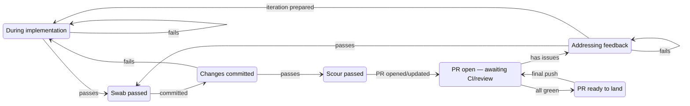
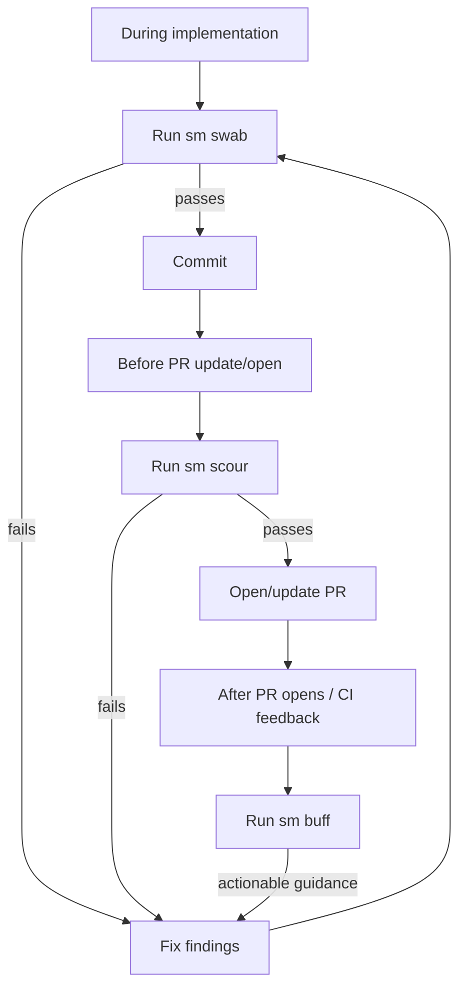

# Slop-Mop Workflow

> **Auto-generated** — do not edit by hand.
> Source of truth: `slopmop/workflow/state_machine.py`
> Re-generate: `python scripts/gen_workflow_diagrams.py`

The slop-mop development loop is a small state machine.  Every tool
invocation advances the machine; the terminal `walk-forward` gate in
`sm scour` always tells you the next step.

---

## Relationship diagram

---

## Developer timeline

---

## States

| State | Meaning | Docstring |
|---|---|---|
| `coding` | During implementation | Every possible position in the development loop. |
| `swab_clean` | Swab passed | Every possible position in the development loop. |
| `buff_iterating` | Addressing feedback | Every possible position in the development loop. |
| `committed` | Changes committed | Every possible position in the development loop. |
| `scour_clean` | Scour passed | Every possible position in the development loop. |
| `pr_open` | PR open — awaiting CI/review | Every possible position in the development loop. |
| `pr_ready` | PR ready to land | Every possible position in the development loop. |

---

## Transitions

| From state | Event | To state | Next action |
|---|---|---|---|
| `coding` | `swab\_passed` | `swab\_clean` | git commit your changes |
| `coding` | `swab\_failed` | `coding` | fix the reported findings, re-run sm swab |
| `buff\_iterating` | `swab\_passed` | `swab\_clean` | git commit your changes |
| `buff\_iterating` | `swab\_failed` | `buff\_iterating` | fix the reported findings, re-run sm swab |
| `swab\_clean` | `git\_committed` | `committed` | sm scour |
| `committed` | `scour\_passed` | `scour\_clean` | git push && open or update PR |
| `committed` | `scour\_failed` | `coding` | fix the reported findings, re-run sm swab |
| `scour\_clean` | `pr\_opened` | `pr\_open` | sm buff inspect |
| `pr\_open` | `buff\_has\_issues` | `buff\_iterating` | sm buff iterate — then fix findings and run sm swab |
| `pr\_open` | `buff\_all\_green` | `pr\_ready` | sm buff finalize --push |
| `buff\_iterating` | `iteration\_started` | `coding` | fix findings, then run sm swab |
| `pr\_ready` | `pr\_opened` | `pr\_open` | sm buff inspect |
